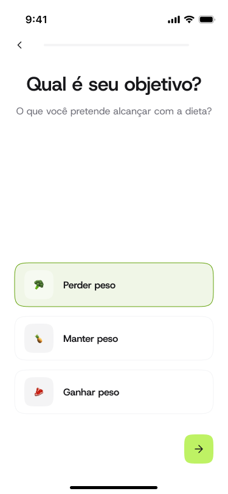
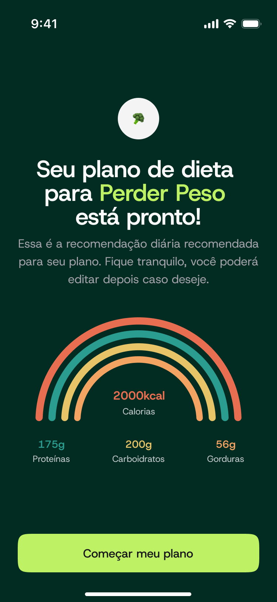
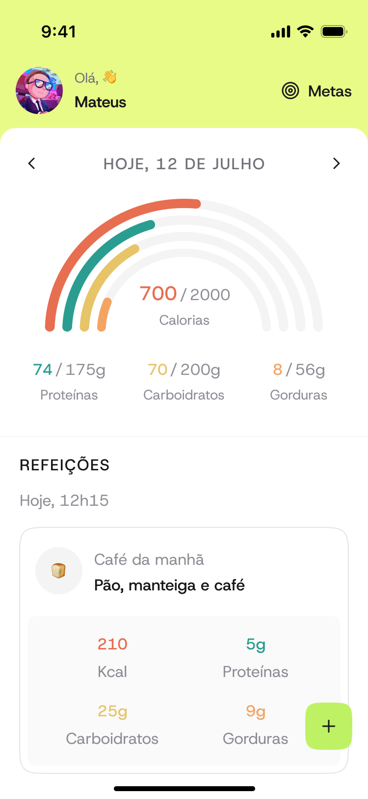
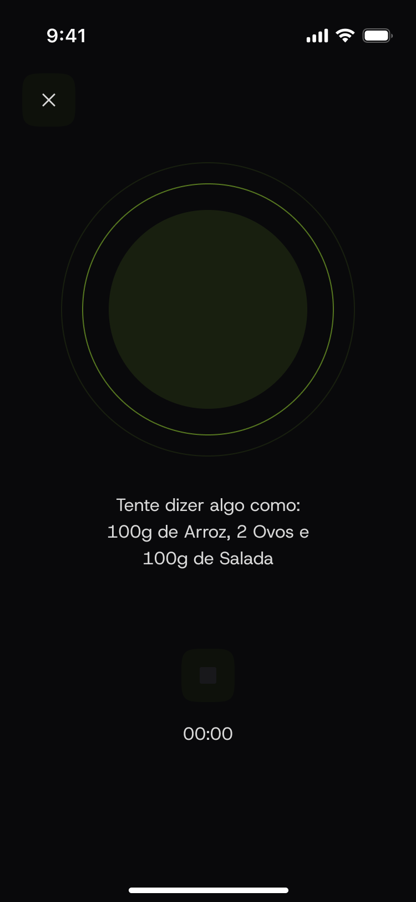
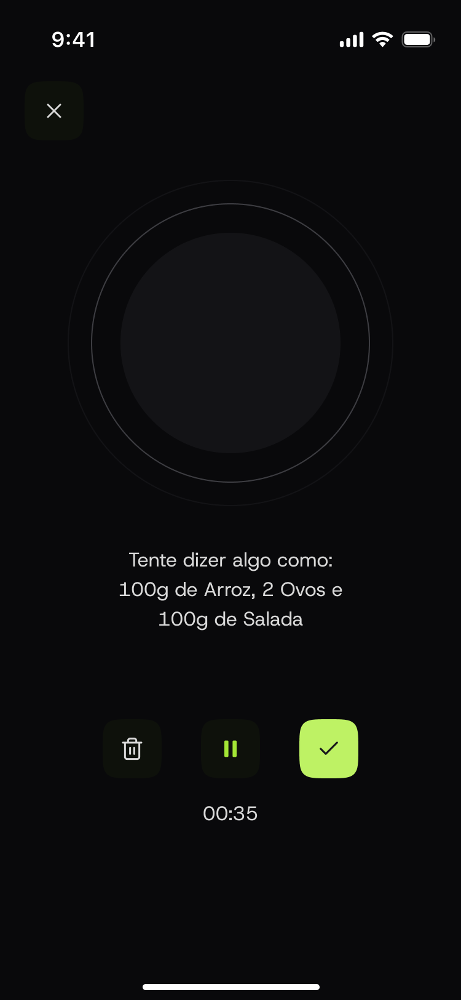
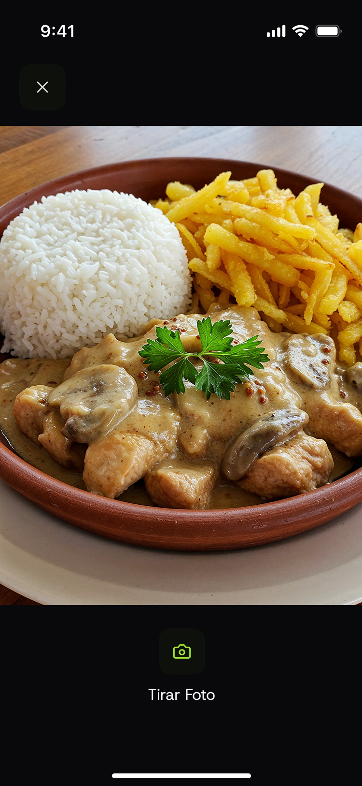
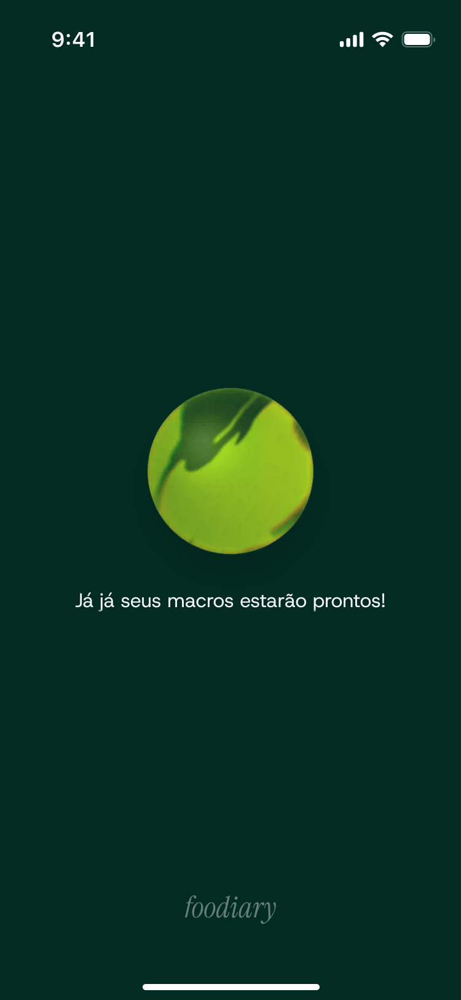

# Foodiary

> App mobile de rastreamento nutricional com análise de refeições por IA

Aplicação serverless full-stack que permite registrar refeições através de fotos ou áudio, recebendo análises nutricionais automáticas por GPT-4. Calcula metas personalizadas e acompanha o consumo diário de calorias e macronutrientes.

## Screenshots

<p align="center">
  
  
  
  
</p>

<p align="center">
  
  
  
  
</p>

<p align="center">
  
  
</p>

## Funcionalidades

- Registro de refeições por **foto** (GPT-4 Vision) ou **áudio** (transcrição + análise)
- Análise automática de macronutrientes (proteínas, carboidratos, gorduras)
- Cálculo personalizado de metas nutricionais (equação Harris-Benedict)
- Autenticação e gestão de perfil (AWS Cognito)
- Acompanhamento diário com gráficos de progresso
- Processamento assíncrono com atualizações em tempo real

## Stack

### Backend (Serverless)
- **Runtime:** Node.js 22 + TypeScript 5.8
- **Cloud:** AWS Lambda, API Gateway, DynamoDB, S3, SQS, Cognito
- **IA:** OpenAI SDK (GPT-4 Vision/Audio)
- **Framework:** Serverless Framework v4
- **Libs:** Zod, AWS SDK v3, React Email

### Frontend (Mobile)
- **Framework:** React Native 0.81 + Expo SDK 54
- **Linguagem:** TypeScript 5.9 (strict mode)
- **State:** TanStack Query v5, React Context
- **UI:** React Navigation v7, React Hook Form, Moti, Reanimated
- **Libs:** Axios, Zod, Expo Camera/Audio

## Arquitetura

### Backend - Clean Architecture

```
Application Layer
├── Entities (Account, Profile, Goal, Meal)
├── Use Cases (CreateMeal, UpdateProfile, CalculateGoals)
└── Controllers (HTTP handlers)

Infrastructure Layer
├── Database (DynamoDB Single Table Design)
├── AI (OpenAI integration)
└── AWS Services (S3, SQS, Cognito)

Kernel
└── Dependency Injection (custom registry com decorators)
```

**Design Patterns:**
- Dependency Injection (decorators + reflection)
- Repository Pattern
- Unit of Work
- Saga Pattern (transações distribuídas)
- Adapter Pattern (Lambda events)

### Frontend - Domain-Driven Design

```
App Layer
├── Services (API clients com namespaces TypeScript)
├── Hooks (Queries/Mutations TanStack Query)
└── Navigation (3-tier: Root → Auth/App → Screens)

UI Layer
├── Screens (Controller Pattern)
└── Components (Variant Pattern)
```

### Fluxo de Processamento (Event-Driven)

```
Cliente → API (presigned URL) → S3 Upload → S3 Trigger
→ SQS Queue → Lambda Processing → GPT-4 Analysis → DynamoDB
```

## Database Design

**DynamoDB Single Table** com GSI para queries otimizadas:

```
Account:  PK=ACCOUNT#id        SK=ACCOUNT#id
Profile:  PK=ACCOUNT#id        SK=PROFILE#id
Goal:     PK=ACCOUNT#id        SK=GOAL#id
Meal:     PK=ACCOUNT#id        SK=MEAL#mealId
          GSI1PK=ACCOUNT#id#MEALS  GSI1SK=MEAL#createdAt#id
```

## Setup

### Backend
```bash
cd foodiary-api
pnpm install
# Configurar .env (OPENAI_API_KEY, AWS credentials, etc)
pnpm run deploy
```

### Frontend
```bash
cd foodiary-app
pnpm install
# Configurar .env (EXPO_PUBLIC_API_URL)
pnpm start
```

## Destaques Técnicos

- **TypeScript strict mode** em todo o projeto
- **Path aliases** para imports limpos
- **Serverless** com otimizações (esbuild, bundles individuais)
- **Segurança**: JWT via Cognito, presigned URLs, validação Zod
- **Observabilidade**: CloudWatch Logs, alarmes DLQ, PITR DynamoDB
- **Performance**: TanStack Query com caching estratégico
- **UX**: Animações suaves, loading states, pull-to-refresh

---

**Desenvolvido com TypeScript, AWS e React Native**
